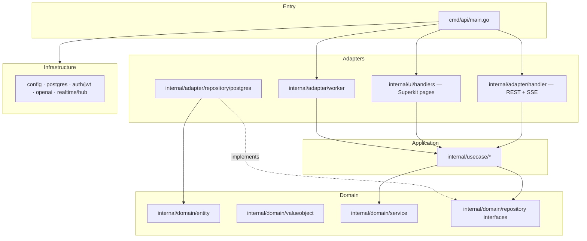

# HomeCoin — Agent Development Index

Household finance app: expense splitting, budgets, piggy banks, settlements, SSE real-time, optional OpenAI budget suggestions.

**Stack:** Go 1.25 · PostgreSQL · [Superkit](https://github.com/anthdm/superkit) (Templ + HTMX) · chi router · Clean Architecture

**Human docs:** [README.md](README.md) · **Agent workflows:** [.cursor/skills/homecoin/SKILL.md](.cursor/skills/homecoin/SKILL.md)

---

## Quick commands

| Command | Purpose |
|---------|---------|
| `make setup` | Copy `.env.example` → `.env` |
| `make templ` | Regenerate Templ `*_templ.go` after editing `.templ` files |
| `make run` | `templ` + `go run ./cmd/api` |
| `make build` | Production binary → `bin/homecoin` |
| `make test` | `go test ./...` |
| `docker compose up --build` | Postgres + API (UI at `:8081`, API at `:8081/api/v1`) |
| `./scripts/ci/smoke_test.sh` | API smoke test |

**Required env:** `DATABASE_URL`, `JWT_SECRET`, `SUPERKIT_SECRET` (32+ chars), `SUPERKIT_ENV` (`development`|`production`)

---

## Architecture



**Dependency rule:** `handler/ui → usecase → domain`. Repositories implement domain interfaces in `adapter/repository`. No business logic in handlers.

---

## Dual interface

| Surface | Path prefix | Auth | Handlers |
|---------|-------------|------|----------|
| **Web UI** | `/`, `/login`, `/dashboard`, … | Cookie session (`SUPERKIT_SECRET`) | `internal/ui/handlers` |
| **REST API** | `/api/v1/*` | JWT Bearer (`JWT_SECRET`) | `internal/adapter/handler` |
| **Health** | `/health` | None | inline in router |
| **SSE** | `/api/v1/households/{id}/events` | JWT (header or `?token=`) | `sse_handler.go` |

Both surfaces call the **same use cases**. Wire new use cases in `cmd/api/main.go` for API; add to `internal/ui/appctx/deps.go` + `appctx.App` for UI.

---

## Directory map

```
cmd/api/main.go              # Composition root: repos, use cases, workers, routers
migrations/                  # SQL migrations (also copied to infrastructure/postgres/migrations)
internal/
  domain/
    entity/                  # DB models (Expense, Budget, PiggyBank, …)
    valueobject/             # Email, Money, SplitType, UserRole
    service/                 # SplitCalculator, DebtCalculator, BudgetMonitor
    repository/              # Repository interfaces only
    errors/                  # Sentinel errors (ErrNotFound, ErrForbidden, …)
  usecase/
    auth/ household/ expense/ balance/ budget/ category/
    settlement/ piggybank/ notification/ reminder/
    householdguard/          # Verify user ∈ household
  adapter/
    handler/                 # REST handlers, router.go, middleware, SSE
    repository/postgres/     # pgx implementations (repos.go, repos_extended.go)
    worker/                  # Balance recalc, outbox→SSE, budget monitor, debt reminders
  infrastructure/
    config/ postgres/ auth/ openai/ realtime/ logger/
  ui/                        # Superkit frontend
    appctx/                  # Application deps + session auth (breaks import cycles)
    handlers/                # kit.HandlerFunc per page/action
    views/**/*.templ         # Templ templates (source of truth)
    views/**/*_templ.go      # Generated — do not edit
    routes.go ui.go          # Route registration, static assets
public/
  assets/app.css             # UI styles
  embed.go                   # go:embed for production static files
deploy/docker/nginx/          # Local Docker TLS (nginx)
infra/                        # Terraform, Ansible, Azure bootstrap + deploy scripts
scripts/ci/                   # smoke_test.sh, install-playwright.sh
scripts/dev/                  # seed.sql, seed_db.sh
```

---

## Domain conventions

- **Money:** always `int64` cents (`amount_cents`, `limit_cents`). Never float in domain/DB.
- **Household:** one per user (`UNIQUE(user_id)` on `household_members`).
- **Currency:** single currency per household.
- **Split types:** `equal` · `exact` · `percentage` · `shares` — see `valueobject.SplitType`, `service.SplitCalculator`.
- **Real-time:** outbox pattern → `OutboxPublisher` worker → `realtime.Hub` → SSE clients.
- **Balance recalc:** async via `recalcCh chan string` (household ID); triggered on expense/settlement changes.

### Outbox event types

`expense.created` · `balance.updated` · `budget.threshold_exceeded` · `settlement.updated` · `piggy_bank.updated`

---

## Use case index

| Package | Use cases | Notes |
|---------|-----------|-------|
| `auth` | Register, Login, Refresh, Me, UpdateProfile | JWT + refresh tokens |
| `household` | Create, Join, Get, GetMine, Leave | Create seeds 8 categories (`seed.go`) |
| `expense` | Add, List | Add triggers recalc + budget check |
| `balance` | Get, Simplify, Recalculate | Simplify uses `DebtCalculator` |
| `budget` | Create, List, Usage, CheckThresholds, Suggest, ListSuggestions, ListAlerts, AckAlert | OpenAI only in Suggest |
| `category` | Create, List | |
| `settlement` | Create, List, UpdateStatus | |
| `piggybank` | Create, Contribute, List | |
| `notification` | List, MarkRead | |
| `reminder` | Schedule, List, Dispatch | Worker runs Dispatch |

---

## REST API index

Full examples in [README.md](README.md). Route tree in `internal/adapter/handler/router.go`.

```
GET  /health
POST /api/v1/auth/{register,login,refresh}
GET  /api/v1/me
PATCH /api/v1/me
GET  /api/v1/notifications
POST /api/v1/notifications/{id}/read
POST /api/v1/households
POST /api/v1/households/join
GET  /api/v1/households/mine
POST /api/v1/households/leave
GET  /api/v1/households/{id}/
GET  /api/v1/households/{id}/events          # SSE
GET|POST /api/v1/households/{id}/expenses
GET  /api/v1/households/{id}/balances[/{simplified}]
GET|POST /api/v1/households/{id}/categories
GET|POST /api/v1/households/{id}/budgets
GET  /api/v1/households/{id}/budgets/{usage,suggestions,alerts}
POST /api/v1/households/{id}/budgets/suggest
POST /api/v1/households/{id}/budgets/alerts/{id}/ack
GET|POST /api/v1/households/{id}/settlements
PATCH /api/v1/households/{id}/settlements/{id}
GET|POST /api/v1/households/{id}/piggy-banks
POST /api/v1/households/{id}/piggy-banks/{id}/contribute
GET|POST /api/v1/households/{id}/reminders
```

---

## Superkit / UI index

Framework: [anthdm/superkit](https://github.com/anthdm/superkit) — `kit.Setup()`, `kit.Handler`, `kit.Render`, session cookies.

### UI routes (`internal/ui/routes.go`)

| Method | Path | Handler |
|--------|------|---------|
| GET | `/login`, `/register` | auth pages |
| POST | `/login`, `/register` | auth actions |
| GET | `/logout` | clear session |
| GET | `/onboarding` | create/join household |
| POST | `/onboarding/create`, `/onboarding/join` | |
| GET | `/dashboard` | budget cups overview |
| GET/POST | `/expenses` | list + add |
| GET | `/balances` | simplified debts |
| GET/POST | `/budgets` | list + create |
| GET/POST | `/piggy-banks` | list + create |
| POST | `/piggy-banks/{id}/contribute` | |

### Superkit patterns in this repo

```go
// Handler signature
func HandleFoo(kit *kit.Kit) error {
    sess, err := appctx.MustAuth(kit)       // redirect to /login if missing
    out, err := appctx.App.SomeUC.Execute(kit.Request.Context(), ...)
    return kit.Render(someview.Page(data))  // or kit.Redirect(http.StatusSeeOther, "/path")
}

// Route registration
r.Get("/foo", kit.Handler(handlers.HandleFoo))

// Templ layout
// internal/ui/views/layouts/base_layout.templ — HTML shell + view.Asset("app.css")
// internal/ui/views/layouts/app_layout.templ — sidebar nav wrapper
```

### Import cycle rule

`internal/ui/handlers` must **not** import `internal/ui` (routes imports handlers). Shared state lives in **`internal/ui/appctx`** (`App`, `MustAuth`, `SetSession`).

### Templ workflow

1. Edit `internal/ui/views/**/*.templ`
2. Run `make templ`
3. Commit both `.templ` and generated `*_templ.go`
4. Docker build runs `templ generate` automatically

### Static assets

- Dev: `public/` served from disk (`SUPERKIT_ENV=development`)
- Prod: `public/embed.go` embeds `public/assets/*`
- CSS path helper: `view.Asset("app.css")` → `/public/assets/app.css`

---

## Background workers (`cmd/api/main.go`)

| Worker | Trigger | Use case |
|--------|---------|----------|
| `BalanceRecalculator` | `recalcCh` | `balance.RecalculateUseCase` |
| `OutboxPublisher` | every 2s | publishes pending outbox → SSE hub |
| `BudgetMonitorWorker` | every 5m | `budget.CheckThresholdsUseCase` |
| `DebtReminderWorker` | every 1m | `reminder.DispatchUseCase` |

---

## Adding features (checklist)

### New REST endpoint
1. Add/extend use case in `internal/usecase/<pkg>/`
2. Add handler method in `internal/adapter/handler/`
3. Register route in `router.go`
4. Wire use case in `cmd/api/main.go` → `handler.Deps`

### New UI page
1. Add `internal/ui/views/<pkg>/<page>.templ`
2. Add handler in `internal/ui/handlers/`
3. Register in `internal/ui/routes.go`
4. Expose use case via `appctx.Application` if not already there
5. `make templ && make build`

### New DB table/column
1. Add SQL to `migrations/00000N_*.up.sql` (+ `.down.sql`)
2. Copy to `internal/infrastructure/postgres/migrations/` (embedded auto-migrate)
3. Add entity + repository interface + postgres repo method
4. Add use case

### Tests
- Domain logic: `internal/domain/service/*_test.go` (existing pattern)
- Run: `make test`

---

## Do not

- Put business logic in handlers (REST or UI)
- Edit `*_templ.go` files manually
- Use floats for money
- Import `internal/ui` from `internal/ui/handlers` (use `appctx`)
- Skip `SUPERKIT_SECRET` (app exits at startup via `kit.Setup()`)
- Commit `.env` or secrets

---

## Key files to read first

| Task | Start here |
|------|------------|
| Understand wiring | `cmd/api/main.go` |
| REST patterns | `internal/adapter/handler/handlers.go` |
| UI patterns | `internal/ui/handlers/dashboard.go` |
| Business rules | `internal/usecase/expense/expense.go` |
| Split math | `internal/domain/service/split_calculator.go` |
| Debt simplification | `internal/domain/service/debt_calculator.go` |
| Schema | `migrations/000001_init.up.sql` |
| Superkit routes | `internal/ui/routes.go` |
