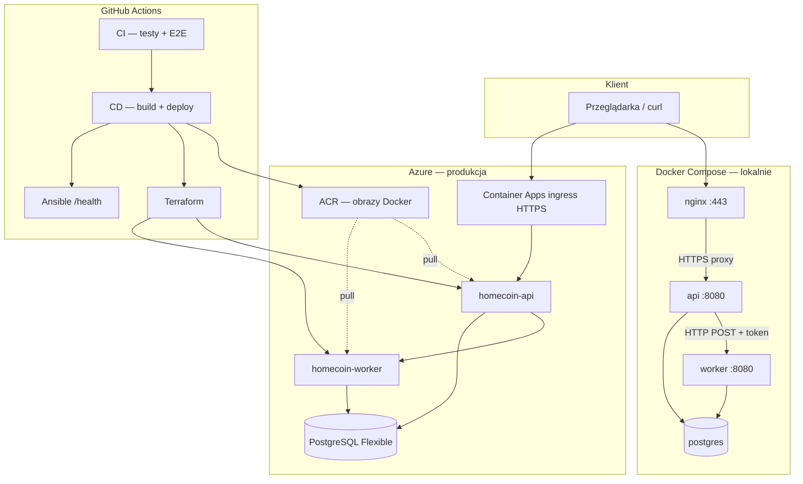

# HomeCoin — przewodnik po repozytorium i infrastrukturze

Ten dokument wyjaśnia **każdą sekcję prezentacji zaliczeniowej** i pokazuje, **gdzie to jest w kodzie / infrastrukturze**. Przydatny przed obroną projektu, gdy prowadzący pyta „pokaż mi w repozytorium”.

Powiązane pliki:
- [prezentacja.tex](presentation/prezentacja.tex) — slajdy
- [OCENA.md](OCENA.md) — mapowanie na kryteria oceny
- [DEPLOYMENT.md](DEPLOYMENT.md) — szczegóły wdrożenia Azure
- [AGENTS.md](../AGENTS.md) — indeks techniczny dla agentów AI

---

## 1. Wprowadzenie — czym jest HomeCoin?

**HomeCoin** to aplikacja webowa do finansów domowych:
- dzielenie wydatków między domowników,
- budżety i alerty,
- skarbonki (piggy banks),
- rozliczenia i uproszczone salda,
- powiadomienia i przypomnienia o długach.

### Dwa interfejsy, jedna logika biznesowa

| Powierzchnia | Adres | Autoryzacja | Kod |
|--------------|-------|-------------|-----|
| **Web UI** | `/`, `/dashboard`, `/expenses`, … | Cookie sesji (Superkit) | `internal/ui/` |
| **REST API** | `/api/v1/*` | JWT Bearer | `internal/adapter/handler/` |
| **Health** | `/health` | brak | `router.go` |
| **SSE (real-time)** | `/api/v1/households/{id}/events` | JWT | `sse_handler.go` |

Oba interfejsy wołają **te same use case’y** (`internal/usecase/`).

### Stos technologiczny

| Warstwa | Technologia |
|---------|-------------|
| Backend | Go 1.25 |
| Baza | PostgreSQL 16 |
| UI | Superkit + Templ + HTMX |
| Router HTTP | chi |
| Chmura | Azure Container Apps + PostgreSQL Flexible Server |
| IaC | Terraform + Ansible |
| CI/CD | GitHub Actions |

---

## 2. Mapa repozytorium — co gdzie leży

```
homecoin/
├── cmd/                          # Punkty wejścia (binaria)
│   ├── api/main.go               # Usługa API (REST + UI + SSE)
│   ├── worker/main.go            # Usługa worker (zadania w tle)
│   └── migrate/main.go           # Migracje schematu DB
│
├── internal/
│   ├── domain/                   # Logika domenowa (bez zależności od DB/HTTP)
│   │   ├── entity/               # Modele: Expense, Budget, User, …
│   │   ├── valueobject/          # Email, Money, SplitType
│   │   ├── service/              # SplitCalculator, DebtCalculator
│   │   └── repository/           # Interfejsy repozytoriów (tylko kontrakty)
│   │
│   ├── usecase/                  # Aplikacja — orchestracja biznesu
│   │   ├── auth/ expense/ balance/ budget/ …
│   │
│   ├── adapter/
│   │   ├── handler/              # REST API + middleware + SSE
│   │   ├── repository/postgres/  # Implementacje repozytoriów (pgx)
│   │   └── worker/               # Workery w procesie API (outbox, budżety)
│   │
│   ├── infrastructure/           # Szczegóły techniczne
│   │   ├── config/ postgres/ auth/ openai/ realtime/
│   │   └── workerclient/         # Klient HTTP do workera
│   │
│   └── ui/                       # Frontend Superkit
│       ├── handlers/             # Handlery stron
│       ├── views/**/*.templ      # Szablony HTML (źródło)
│       └── appctx/               # Sesja + wstrzykiwanie use case’ów
│
├── migrations/                   # SQL migracje (źródło prawdy)
├── docker-compose.yml            # Lokalny stack (db)
├── Dockerfile                    # Obrazy: api, worker, migrate
├── .github/workflows/            # CI/CD (dst, bdb)
├── infra/                        # Terraform + Ansible (dst)
├── deploy/docker/nginx/          # HTTPS lokalnie (dst+)
├── test/e2e/                     # Testy E2E (bdb)
└── scripts/ci/                   # smoke_test.sh (bdb)
```

### Zasada Clean Architecture w praktyce

Przepływ zależności (zawsze do środka):

```
UI handler / REST handler
        ↓
    use case
        ↓
  domain (entity + service + interfejs repo)
        ↑
  adapter/repository/postgres (implementacja)
```

**Reguła:** logika biznesowa nie siedzi w handlerach. Handler tylko parsuje HTTP i woła use case.

---

## 3. Sekcja prezentacji: **Wprowadzenie**

**Slajd:** „Projekt: HomeCoin” — ogólny opis i linki.

### Co warto wiedzieć

- Aplikacja ma **gospodarstwo domowe** (household) — jeden użytkownik = jedno gospodarstwo.
- Pieniądze są w **centach** (`int64`), nigdy float.
- Real-time działa przez **outbox pattern**: zdarzenie zapisane w DB → worker publikuje → SSE do klienta.

### Kluczowe pliki startowe

| Plik | Rola |
|------|------|
| `cmd/api/main.go` | Składa całą aplikację: repo, use case, router, UI |
| `internal/adapter/handler/router.go` | Drzewo tras REST API |
| `internal/ui/routes.go` | Trasy stron webowych |
| `README.md` | Dokumentacja użytkowa |

---

## 4. Sekcja prezentacji: **dst** — CRUD + chmura + CI/CD

**Wymaganie oceny:** aplikacja CRUD, wdrożona w chmurze, z potokiem CI/CD.

### 4.1 CRUD — REST API

Wszystkie operacje CRUD idą przez `/api/v1/...`. Przykłady:

| Zasób | Endpointy | Use case | Handler |
|-------|-----------|----------|---------|
| Wydatki | `GET/POST …/expenses` | `usecase/expense/` | `expense_handler.go` |
| Budżety | `GET/POST …/budgets` | `usecase/budget/` | `budget_handler.go` |
| Kategorie | `GET/POST …/categories` | `usecase/category/` | `category_handler.go` |
| Rozliczenia | `GET/POST/PATCH …/settlements` | `usecase/settlement/` | `settlement_handler.go` |
| Skarbonki | `GET/POST …/piggy-banks` | `usecase/piggybank/` | `piggybank_handler.go` |
| Auth | `POST /auth/register`, `/login` | `usecase/auth/` | `auth_handler.go` |

**Przykład przepływu — dodanie wydatku:**

```
POST /api/v1/households/{id}/expenses
  → ExpenseHandler.Add
  → expense.AddUseCase.Execute
      → sprawdza członkostwo w gospodarstwie
      → SplitCalculator dzieli kwotę
      → zapis do PostgreSQL
      → wpis do outbox (balance.updated)
      → trigger przeliczenia sald (worker)
      → CheckThresholds (budżet)
```

### 4.2 Wdrożenie w chmurze (Azure)

Infrastruktura w **`infra/`**:

| Komponent | Plik / folder | Co robi |
|-----------|---------------|---------|
| Terraform | `infra/terraform/homecoin/` | Tworzy RG, ACR, PostgreSQL, Container Apps |
| Ansible | `infra/ansible/playbooks/homecoin.yml` | Po deployu: sprawdza `/health` |
| Skrypty | `infra/scripts/` | Automatyzacja z GitHub Actions |
| Bootstrap | `infra/bootstrap/setup-github-oidc.sh` | Jednorazowo: OIDC dla GitHub → Azure |

**Co jest na Azure:**
- **Azure Container Registry (ACR)** — obrazy Docker (`homecoin-api`, `homecoin-worker`)
- **Azure Database for PostgreSQL** — baza produkcyjna (`sslmode=require`)
- **Azure Container Apps** — uruchamia `api` i `worker` (HTTPS na ingress)

**URL produkcyjny:** endpoint `/health` na Container App (np. `https://homecoin-api….azurecontainerapps.io/health`).

### 4.3 CI/CD — GitHub Actions

Trzy workflow’y w `.github/workflows/`:

| Workflow | Plik | Kiedy | Co robi |
|----------|------|-------|---------|
| **CI** | `ci.yml` | push/PR na `main` | testy, lint, build, Docker build, E2E |
| **CD — Azure** | `cd-azure.yml` | push na `main` | build obrazów → push ACR → Terraform → Ansible |
| **Azure Infrastructure** | `azure-infra.yml` | ręcznie | pierwsze utworzenie zasobów platformy |

**Przepływ CD (uproszczony):**

```
git push main
    → CI (testy muszą przejść)
    → CD: docker build api + worker
    → push do ACR
    → terraform apply (Container Apps z nowymi tagami obrazów)
    → ansible-playbook (curl /health)
```

---

## 5. Sekcja prezentacji: **dst+** — bezpieczeństwo

**Wymaganie oceny:** HTTPS + bezpieczne przechowywanie danych (hasła, tokeny).

### 5.1 HTTPS

| Środowisko | Jak |
|------------|-----|
| **Lokalnie** | Nginx terminuje TLS (`deploy/docker/nginx/`), certyfikaty: `generate-certs.sh`, port **8081** (HTTPS) |
| **Azure** | Container Apps ma `external: true` — platforma wymusza HTTPS na ingress |

Pliki:
- `deploy/docker/nginx/nginx.conf` — reverse proxy do `api:8080`
- `docker-compose.yml` — serwis `nginx` na porcie 443 (mapowany na 8081)

### 5.2 Hasła i tokeny

| Aspekt | Implementacja | Plik |
|--------|---------------|------|
| Hasła użytkowników | bcrypt | `internal/infrastructure/auth/jwt.go` |
| Access token | JWT HMAC-SHA256 | ten sam pakiet |
| Refresh token | hash SHA-256 przed zapisem w DB | `refresh_token` repo |
| Sesja UI | cookie Superkit (`SUPERKIT_SECRET`) | `internal/ui/appctx/` |

### 5.3 Nagłówki HTTP

Middleware `SecurityHeaders` w `internal/adapter/handler/middleware/middleware.go`:
- **HSTS** (gdy `TLS_BEHIND_PROXY=true`)
- **X-Frame-Options: DENY**
- **X-Content-Type-Options: nosniff**

### 5.4 Komunikacja API → Worker

- Nagłówek **`X-Worker-Token`** — wspólny sekret (`WORKER_INTERNAL_TOKEN`)
- Worker odrzuca request bez poprawnego tokena
- Kod klienta: `internal/infrastructure/workerclient/trigger.go`
- Endpoint workera: `POST /internal/v1/recalculate` w `cmd/worker/main.go`

### 5.5 Baza w chmurze

PostgreSQL Azure wymaga **`sslmode=require`** w `DATABASE_URL` (ustawiane w Terraform / sekretach GitHub).

---

## 6. Sekcja prezentacji: **db** — Docker Compose

**Wymaganie oceny:** wdrożenie jako kontenery Docker (docker compose).

### Serwisy w `docker-compose.yml`

| Kontener | Rola | Port (host) | Uwagi |
|----------|------|-------------|-------|
| `postgres` | Baza danych | 5433 | healthcheck `pg_isready` |
| `migrate` | Migracje SQL | — | jednorazowy, `restart: no` |
| `worker` | Zadania w tle | wewn. 8080 | czeka na migrate |
| `api` | REST + UI | wewn. 8080 | czeka na migrate + worker |
| `nginx` | TLS + proxy | **8081** (HTTPS) | czeka na api |

### Kolejność startu

```
postgres (healthy)
    → migrate (completed)
        → worker (healthy)
            → api (healthy)
                → nginx
```

### Uruchomienie lokalne

```bash
./deploy/docker/nginx/generate-certs.sh   # certyfikaty TLS
docker compose up --build
curl -k https://127.0.0.1:8081/health    # {"status":"ok"}
```

UI: `https://127.0.0.1:8081`

### Dockerfile — trzy obrazy z jednego pliku

`Dockerfile` ma targety:
- **`api`** — binarka z `cmd/api`
- **`worker`** — binarka z `cmd/worker`
- **`migrate`** — binarka z `cmd/migrate`

---

## 7. Sekcja prezentacji: **db+** — mikrousługi

**Wymaganie oceny:** minimum **2 komunikujące się** kontenery aplikacyjne.

### Dwie mikrousługi aplikacyjne

| Usługa | Binarka | Odpowiedzialność |
|--------|---------|------------------|
| **api** | `cmd/api/main.go` | CRUD, UI Superkit, SSE (outbox publisher w tle) |
| **worker** | `cmd/worker/main.go` | Przeliczanie sald, monitoring budżetów, przypomnienia |

Oba procesy są **osobnymi kontenerami** z własnym `/health`.

### Jak się komunikują

```
api                          worker
 │                              │
 │  POST /internal/v1/recalculate
 │  Header: X-Worker-Token      │
 ├─────────────────────────────►│
 │                              │ RecalculateUseCase
 │                              │ (salda, outbox)
 │                              │
 api ◄──── PostgreSQL ────────► worker
         (wspólna baza)
```

**Kiedy API woła workera:**
- po dodaniu wydatku (`usecase/expense/`)
- po zmianie statusu rozliczenia (`usecase/settlement/`)

**Konfiguracja:**
- `WORKER_URL=http://worker:8080` (w docker-compose / Azure)
- `WORKER_INTERNAL_TOKEN` — ten sam sekret w obu usługach

### Workery w procesie API vs osobny worker

W `cmd/api/main.go` nadal działają lekkie workery **w tle samego API**:
- `OutboxPublisher` — czyta outbox → wysyła SSE
- `BudgetMonitorWorker` — sprawdza progi budżetów

**Ciężkie przeliczenia sald** są delegowane do **osobnej mikrousługi worker** — to spełnia wymaganie db+.

---

## 8. Sekcja prezentacji: **bdb** — testy w CI/CD

**Wymaganie oceny:** testy jednostkowe + E2E w potoku CI/CD.

### 8.1 Testy jednostkowe

Uruchamiane w jobie **Unit tests** (`go test ./... -race`):

| Obszar | Lokalizacja | Co testuje |
|--------|-------------|------------|
| Logika domeny | `internal/domain/service/*_test.go` | Dzielenie wydatków, uproszczanie długów |
| Auth | `internal/infrastructure/auth/jwt_test.go` | Hash haseł, JWT |
| Worker client | `internal/infrastructure/workerclient/trigger_test.go` | Trigger HTTP do workera |

Lokalnie: `make test`

### 8.2 Testy E2E

Job **E2E tests** w `ci.yml`:

```
1. Generowanie certyfikatów TLS
2. docker compose up -d --build --wait   ← pełny stack
3. ./scripts/ci/smoke_test.sh            ← bash: rejestracja → wydatek
4. go test -tags=e2e ./test/e2e/...      ← Go + Playwright
```

| Plik testu | Co sprawdza |
|------------|-------------|
| `scripts/ci/smoke_test.sh` | REST API flow (curl) |
| `test/e2e/api_test.go` | API przez HTTPS |
| `test/e2e/ui_test.go` | Formularze HTML, sesja cookie |
| `test/e2e/playwright_test.go` | Chromium — pełny flow UI |

Lokalnie: `make e2e`

### Gdzie zobaczyć w GitHub

**Actions → workflow CI → run → job „E2E tests"** (ostatni na liście).

---

## 9. Sekcja prezentacji: **Podsumowanie**

Slajd „Mapowanie kryteriów" — skrót tego dokumentu:

| Ocena | Kluczowy dowód w repo |
|-------|----------------------|
| **dst** | `router.go` (CRUD), `infra/` (Azure), `.github/workflows/` |
| **dst+** | `deploy/docker/nginx/`, `middleware.go`, `auth/jwt.go` |
| **db** | `docker-compose.yml` |
| **db+** | `cmd/api` + `cmd/worker`, `workerclient/` |
| **bdb** | `*_test.go`, `test/e2e/`, job E2E w `ci.yml` |

---

## 10. Diagram — cały system (lokalnie i w chmurze)



---

## 11. Szybka ściąga — „gdzie to jest?"

| Pytanie na obronie | Odpowiedź / plik |
|--------------------|------------------|
| Gdzie jest CRUD wydatków? | `usecase/expense/` + `expense_handler.go` |
| Gdzie dzielenie kosztów? | `domain/service/split_calculator.go` |
| Gdzie uproszczone salda? | `domain/service/debt_calculator.go` |
| Gdzie HTTPS lokalnie? | `deploy/docker/nginx/` |
| Gdzie bcrypt? | `infrastructure/auth/jwt.go` → `HashPassword` |
| Gdzie mikrousługi? | `cmd/api/main.go` + `cmd/worker/main.go` |
| Jak API woła workera? | `workerclient/trigger.go` → `POST /internal/v1/recalculate` |
| Gdzie Terraform? | `infra/terraform/homecoin/` |
| Gdzie CI? | `.github/workflows/ci.yml` |
| Gdzie CD na Azure? | `.github/workflows/cd-azure.yml` |
| Gdzie testy E2E? | `test/e2e/` + job `e2e` w `ci.yml` |
| Gdzie migracje DB? | `migrations/*.sql` |
| Gdzie UI (strony)? | `internal/ui/views/` + `handlers/` |

---

## 12. Zmienne środowiskowe — minimum do zapamiętania

| Zmienna | Usługa | Po co |
|---------|--------|-------|
| `DATABASE_URL` | api, worker | Połączenie z PostgreSQL |
| `JWT_SECRET` | api | Podpis tokenów API |
| `SUPERKIT_SECRET` | api | Sesja cookie UI (32+ znaków) |
| `WORKER_URL` | api | Adres mikrousługi worker |
| `WORKER_INTERNAL_TOKEN` | api + worker | Autoryzacja API→worker |
| `TLS_BEHIND_PROXY` | api | Włącza HSTS (za nginx / Azure) |

Pełna lista: `.env.example`

---

*Ostatnia aktualizacja: zgodnie ze strukturą repo i prezentacją na ocenę **bdb**.*
